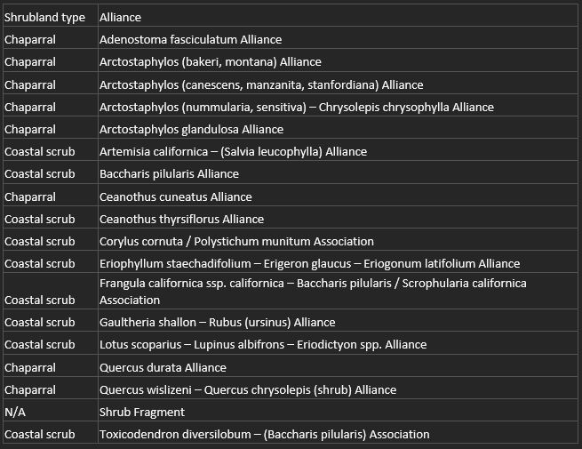

# peak-health-mapping
Repo for spatial analysis and cartography documentation for Peak Health 2022
## Shrubland Analysis in ArcGIS Pro 
### Deliverable: 
1. Contiguous patches of chaparral and scrubland >30 acres in area of focus derived from 2018 veg map 
2. Summary of total acres and acres of each class 
3. Map of chaparral and scrub classified 
4. Map of total extent of all classes 

### Workflow: 
1. Query veg map classes below:

